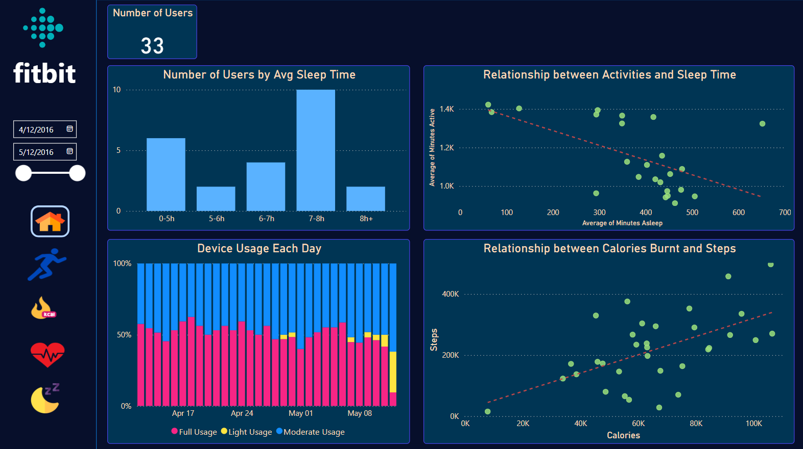
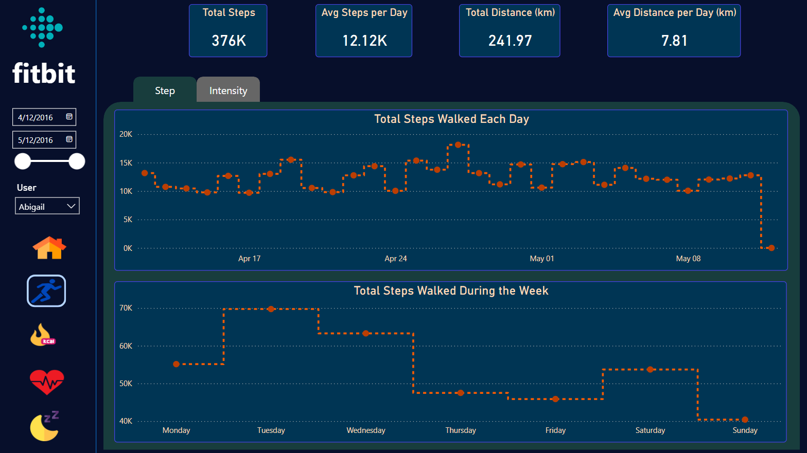
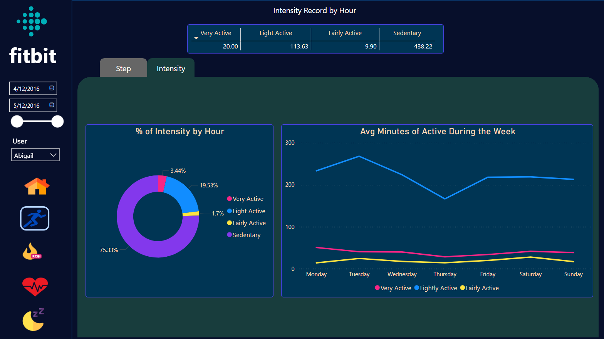
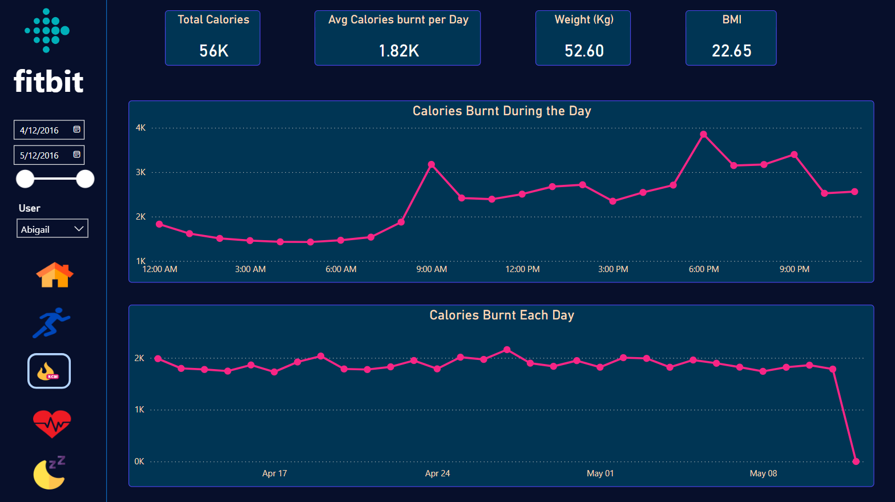
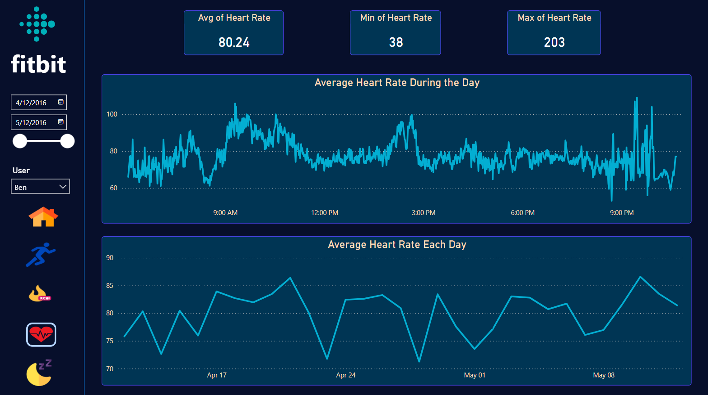
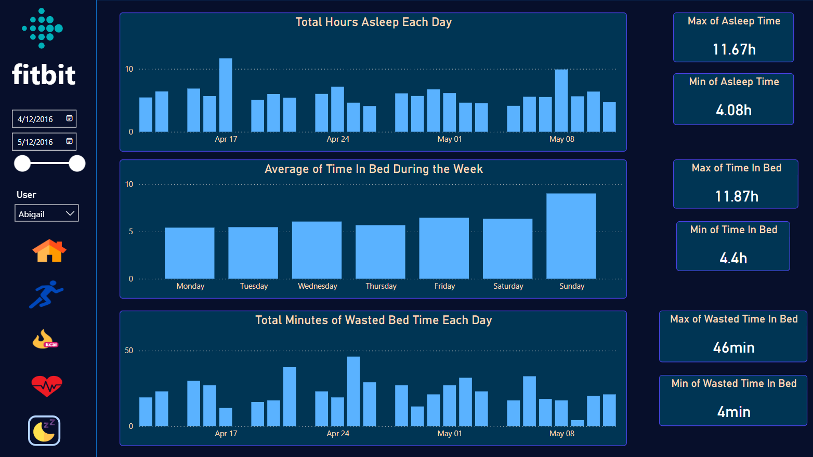

# Fitbit Analysis

## Overview
Smartwatches have revolutionised the world, simplifying lives by integrating useful apps and and tracking data to provide valuable information to users. Fitbit is a prominent smartwatch that allows users to monitor their steps, calories burnt, sleep duration, active hours, heart rate, and more, to encourage them to stay fit and healthy. analyse the Fitbit Fitness Tracker Data to gain insights into how users are using the Fitbit app and discover trends using Power BI. The analysis will help users understand their activity patterns and make recommendations to improve their health and fitness levels. The data was collected from the open-source Fitbit for 33 distinct users over the period from 12/4/2016 to 12/05/2016.

Link to [interactive report](https://app.powerbi.com/view?r=eyJrIjoiNTE1ZjNkZWMtZmNkMi00ZDEyLTgwODEtNTE5ZGUxNTZkYzcyIiwidCI6Ijg1NzQ0OTQ5LTgyNzctNDBmOS05ZDAyLTAyOTZiNjI0YjhjOCJ9)

## Project Goals
- What is the trend in device usage over the period?
- What are the users' sleeping patterns?
- How does activity time affect sleep time?
- Is there a relationship between calories burned and steps walked by users?
- What is the trend in steps taken and distance covered over time?
- How do users allocate their time to daily activities during the specific period?
- How can calories burned be tracked for each user over time?
- How can users track their weight?
- What is the pattern of heart rates over time?
- How can asleep time and time in bed be tracked for each user?

## Dashboard Overview
The Fitbit Report provide a user-friendly interface and offer the following views:

### Home Dashboard
- The number of users who used the device for a full day was higher when they first bought it but decreased significantly over time, especially within the second month. The number of users using the device for half of the day remained stable. The number of users using the device for less than 8 hours increased significantly in the following month.
- There is a positive correlation between the number of steps walked and the calories burnt. The more steps taken, the more calories burnt.
- Most users spend 7 to 8 hours sleeping.
- There is an inverse relationship between activity minutes and the time spent sleeping. The fewer minutes users spend on activities, the more time they spend asleep.

### Activity Dashboard
- Tracking the total steps walked over time and weekly for each user.
- Monitoring the average daily distance and the total distance walked by each user over the specific period.

- Recording the intensity level for each user throughout the week, including very active, light active, fairly active, and sedentary.

### Calories Dashboard
- Monitoring the calories burnt throughout the day to observe the most active times. 
- Keep track of each user's weight and BMI.

### Heart Rate Dashboard
- Only 14 users reported their heart rate data.
- Tracking the heart rate for each user over time to observe the pattern.

### Sleep Dashboard
- Only 24 users reported their sleep data.
- Monitoring the time spent asleep, the time spent in bed and the wasted time in bed for each user over time.

